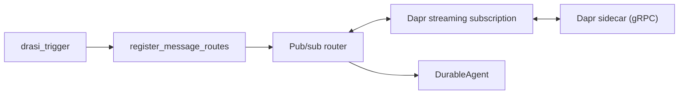

<!--
Copyright 2026 The Dapr Authors
Licensed under the Apache License, Version 2.0 (the "License");
you may not use this file except in compliance with the License.
You may obtain a copy of the License at
    http://www.apache.org/licenses/LICENSE-2.0
Unless required by applicable law or agreed to in writing, software
distributed under the License is distributed on an "AS IS" BASIS,
WITHOUT WARRANTIES OR CONDITIONS OF ANY KIND, either express or implied.
See the License for the specific language governing permissions and
limitations under the License.
-->

# AGENTS.md - dapr-agents-ext-drasi

## Repo-wide rules

- Use the root [AGENTS.md](../../AGENTS.md) for environment setup, formatting, linting, type checking, testing, PR requirements, and licensing.
- If this file and the root file disagree on shared rules, the root file wins.

## Source layout

```text
ext/dapr-agents-ext-drasi/
├── pyproject.toml                          # Extension package metadata and uv config
├── README.md                               # Extension overview and usage
├── LICENSE                                 # Apache 2.0
├── PROVENANCE.md                           # Provenance / generated-artifact notes
├── scripts/
│   └── generate-drasi-models.sh            # Regenerates Drasi schema models
├── dapr_agents/
│   └── ext/
│       └── drasi/                          # PEP 420 namespace package under dapr_agents.ext
│           ├── __init__.py                 # Public package exports
│           ├── activations.py              # drasi_trigger activation wiring
│           ├── types.py                    # Re-exported Drasi event models and public names
│           ├── schemas/                    # Generated Drasi schema models
│           │   └── unpacked/               # Generated model files (do not edit by hand)
│           └── utils/
│               └── validation.py           # Event/model validation helpers
└── tests/
    ├── test_drasi_trigger.py               # Activation wiring and trigger behavior tests
    ├── schemas/
    │   └── test_unpacked_event_models.py   # Generated event model smoke tests
    └── utils/
        └── test_validation.py              # Validation helper tests
```

## Architecture



The extension is intentionally thin:

- `drasi_trigger` resolves and validates configuration at activation time.
- Configuration is used to customize filtering/mapping/routing logic to be executed by the core pub/sub routing infrastructure via the `register_message_routes` interface.
- Drasi change events arrive through Dapr pub/sub, pass through the core pub/sub routing infrastructure, and trigger agent workflows.

## Public API

All public symbols are exported from `dapr_agents.ext.drasi`:

```python
from dapr_agents.ext.drasi import (
    drasi_trigger,      # Register Drasi query subscriptions for an agent
    DrasiChangeEvent,   # Drasi change-event model emitted by a query
    DrasiOperation,     # Drasi operation literal: i, u, or d
)
```

Notes:

- `dapr_agents.ext.drasi.__init__` re-exports the full public surface shown
    above.
- `types.py` re-exports generated Drasi schema models under extension-specific
    public names, including `DrasiChangeEvent` and `DrasiOperation`.
- Anything under `activations.py` or `utils/` should be treated as internal
    unless it is explicitly re-exported or documented here.

## Gotchas

- `dapr_agents.ext` is a PEP 420 namespace package. Do not add an
    `__init__.py` to `dapr_agents/ext/`; that would change import behavior.
- `drasi_trigger` is activation-time wiring only. It does not start the agent
    runtime by itself; it registers pub/sub routes on the target `DurableAgent`.
- The default topic is derived from the query ID as
    `drasi-events-<query_id>`.
- If `pubsub` is omitted, the extension falls back to the agent's configured
    pub/sub. Activation fails if no pub/sub is available, or if the resolved
    `(pubsub, topic)` matches the agent’s own `(pubsub, topic)`.
- `operations` is normalized to a list and only Drasi operations `i`, `u`, and
    `d` are supported.
- `change_model` must be a supported dict, dataclass, or Pydantic model.
- Dedupe is best-effort. If `cachetools` is unavailable, duplicate detection is
    disabled and the extension logs a warning.
- Generated schema files under `schemas/unpacked/` should be regenerated via
    `scripts/generate-drasi-models.sh`; do not hand-edit them.

## Testing and development

- For shared setup, testing, code quality, and PR guidance, use the root
    [AGENTS.md](../../AGENTS.md).
- To install the extension in a consuming project:

    ```bash
    uv add dapr-agents[drasi]
    ```

- To install the extension in editable mode from the repo root:

    ```bash
    uv venv
    source .venv/bin/activate
    uv sync --active --group dev --group test --extra drasi
    ```

- To run extension tests from the repo root:

    ```bash
    uv run --group test pytest ext/dapr-agents-ext-drasi -m "not integration" -v
    ```

- Extension tests currently live in:

    - `tests/test_drasi_trigger.py` — activation wiring and end-to-end trigger
        behavior at the extension boundary
    - `tests/utils/test_validation.py` — validation helpers and schema
        coercion behavior
    - `tests/schemas/test_unpacked_event_models.py` — smoke tests for generated
        model imports and expected shape

- When changing public behavior, add or update tests alongside the extension
    test file and keep the README usage examples aligned.

## Documentation updates

- Update `README.md` when the public API or installation changes.
